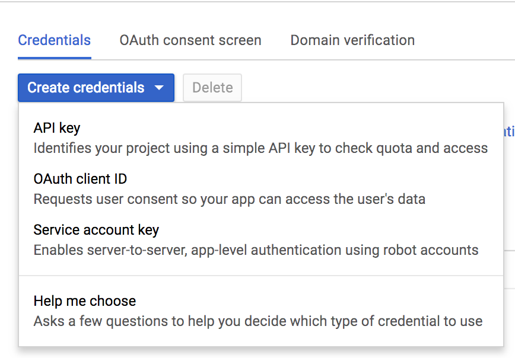

# TYPO3 Extension `google_signin`

This extension makes it possible to sign in in your TYPO3 websites by your google account. This means lLess passwords and faster logins.

The matching property is the email address of the backend or frontendusers

## Features

- Support for Backend users
- Support for Frontend users
- Support of switching google accounts before login

## Requirement

- TYPO3 CMS 8+
- https
- Basic knowledge about Google API configuration
- Google account for the ones who need it

## Configuration

To be able to sign in by google, a bit of configuration is required.

## 1) Create an account on Google Cloud Platform

Go to https://console.cloud.google.com/ and create a new project.

### 2) Create credentials

Switch to **credentials** and click button **create credentials** and choose *oauth client ID*

Fill in the following options:

- Application type: web application
- Authorized JavaScript origins: Add all domains you are using

**Remember the client ID, you will need it later*

### 3) Authorize Ownership

Go to https://www.google.com/webmasters/tools/home?hl=EN and add site by clicking button **add property**

Add your domain.

**Important**: Only the recommended method *HTML file upload* is supported. follow the instructions and press button **verify**.

## Install extension

Install extension as usual. Use composer with `composer require georgringer/google-signin` or get it from TER (tbd).

### Configuration of extension

The settings in the extension manager are required:

- Add the client ID
- Enable BE/FE

## Usage

Using the extension is very simple

### Backend

By enabling the backend usage in the extension manager, everything is configured.

### Frontend

The following tasks need to be done.

First enable the frontend usage in extension manager

Adopt the template of `EXT:felogin`. Take a look at the example template which can be found here: `EXT:google_signin/Resources/Private/Examples/FrontendLogin.html`.
The following changes has have been make:

- Wrap regular fields with `
...
`
- Add the marker `###GOOGLE_SIGNIN_SWITCH_LINK###` which is replaced by a link to use the google signup
- Add the marker `###GOOGLE_SIGNIN_CONTENT###` which is replaced by the content of google_signup like preview of user

## Debugging

Take a look at JS errors in the browser console.

# Bugs & upcoming features

Take a look at the open issues at https://github.com/georgringer/google_signin/issues.