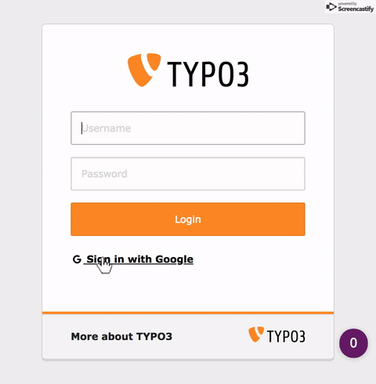
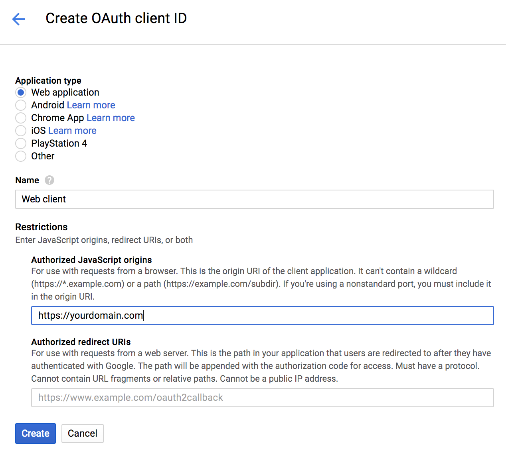
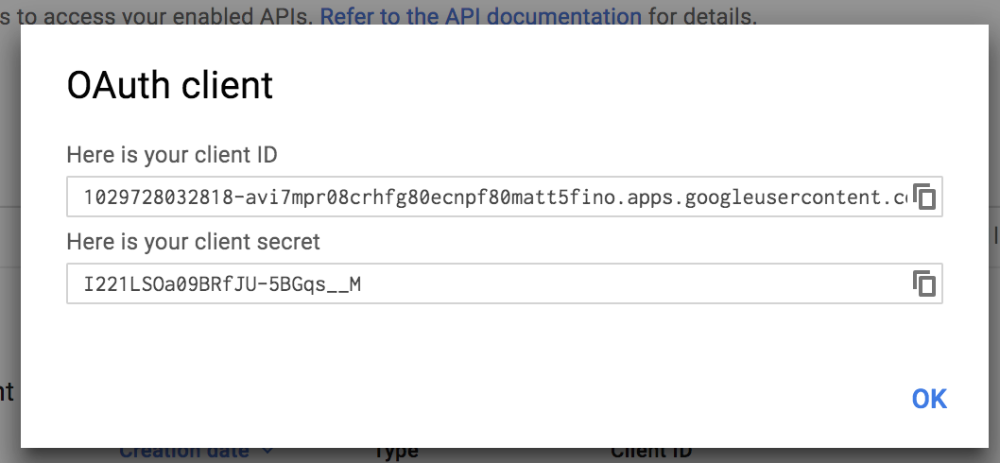

# TYPO3 Extension `google_signin`

This extension makes it possible to sign in in your TYPO3 websites by your google account. Less passwords, faster logins

**Not ready to use for production *yet*!**

## Requirement

- TYPO3 CMS 8+
- https
- Basic knowledge about Google API configuration

## Installation & Configuration

## Create an account on Google Cloud Platform

Go to https://console.cloud.google.com/ and create a new project.

### Create credentials

Switch to **credentials** and click button **create credentials** and choose *oauth client ID*

Fill in the following options:

- Application type: web application
- Authorized JavaScript origins: Add all domains you are using

**Remember the client ID, you will need it later*

### Authorize Ownership

Go to https://www.google.com/webmasters/tools/home?hl=EN and add site by clicking button **add property**

Add your domain.

**Important**: Only the recommended method *HTML file upload* is supported. follow the instructions and press button **verify**.

## Install extension

Install extension as usual. Use composer with `composer require georgringer/google-signin` or get it from TER (tbd).

### Configuration

The settings in the extension manager are required:

- Add the client ID
- Enable BE/FE

# todos

- stabilize service
    - logs
    - validate in own package
- fe auth
- error in js
- docs
- testing
- creating of phar file
- auto create user for business
- sync avatar
